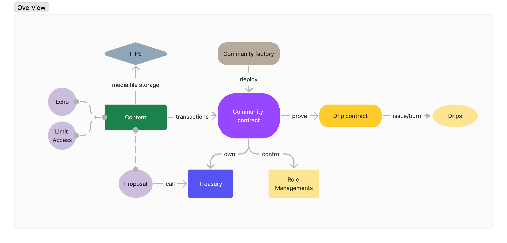

# DOC

1. **What is Popula?**

Popula is a user-owned platform for communities built on NEAR Protocol. It has many independent all-in-one communities which deployed by users.

2. **Architecture**

The figure shows the major parts of Popula and how they interact with others.

<figure><figcaption></figcaption></figure>

**Community**

Community([community](https://github.com/beepopula/community)) is a core concept in Popula. It is probably the most important use case for bridging the protocol layer and the application layer. In the beginning, a community is an independent contract that is deployed from a community factory(https://github.com/beepopula/community-genesis). Then the community owner can post or manage to the community.

**Drips**

Drips([drip-contract](https://github.com/beepopula/Drip-contract)), are non-transferable fungible tokens, which can be used to prove participation and measure valuable contributions, and also be used for accessing gated content. If a user wants to gain its drips, it must do actions in a community, and then the community can prove to Drip Contract that it has these contributions and issue drips to this user. In addition, drips are not accumulated by all communities, they are separated.

3. **Contents**

Contents need a lot of storage space to save. On top of this, in Popula, we also want to use the protocol layer to prove what community participants have done, these lead to greater on-chain storage requirements.

A common way to meet the data requirement is to store all necessary data in transactions on-chain, and the users have to pay storage fees for their data. The advantage of this method is that it is fully decentralized, with all get and set methods in the contract. However, the users have to pay more, and not using the allowance feature in Near Protocol is also a waste.

Here we choose another approach to achieve our goal. The purpose is to prove that someone said something, so we only need to store a hash of the content and make it anti-collision most approximately. This can be represented as:

```
                                  `target_hash = Hash(text + block_number)`
```

The `target_hash` will be the output of this action, so the plain text will be mapped to this `target_hash` in the history block. We can then determine who sent the text and what the `target_hash` is. But how can the contract know who sent the text? We provide:

```
                             `hierarchy_hash = Hash(account_id + target_hash)`
```

And that's the final hash to be stored. If it's a post in a community, others can find it by providing a `target_hash` and `account_id`. For multi-layers of content, it just needs to be stacked to an array to represent these contents. Then, the hashing procedure is as follows:

```
                 `hierarchy_hash = Hash(hash_prefix + account_id + target_hash)`
```

`hash_prefix` is the last layer of `hierarchy_hash`. So why we don't hash it once? Regardless of one-step or two-step hashing, we still need to provide `account_id` of each layer of content to let the contract know who is gaining drips in our protocol layer.

In practice, we choose sha256 as the hashing function, which means the final hash is 32 bytes. We reserve 1 1-byte value to represent other data, and for now it is only used to represent the next layer content count, using 2 bits to represent 0, 1, 2, and other numbers. Finally, we can assume that a single content will likely take 40 bytes.

Depending on that, we can build a tech flow that looks like this:

<figure><figcaption></figcaption></figure>

We can embed anything that can be turned into binary. Just add some fields into text to represent everything that users need.

But for media files, they need an IPFS service to store them. And the URL of these files can be embedded into the text.

Once an `add_content` the transaction is done, the indexer would get this transaction after a few delays (smaller than 3 sec) and push it into the feed. And the poster gets 1 active drip in the community.

4. **Token-gated contents**

Encrypted text can be embedded into content too, the community doesn’t care what is inside the content, so the most important thing is the encryption service, the Lit protocol.

Most cases in Lit protocol are on Ethereum, but for NEAR we build a customized condition code for drips checking.

```jsx
isCreator: "ipfs://QmUzSXwgpB3BC4r73f1GKwQgpV7FXov5SeswCVoSQ9HJ97",
holdTokenGated: "ipfs://QmT3svDg7Y8MKq51kjoiFB8CDe75jzCXV1CkxSYhyxLe4L",
burnTokenGated: "ipfs://QmYtPQTrebRyZRuNuLkw2HyS6AwA72qXDWeWG2oQggbQ59",
signAccess: "ipfs://QmaFrkH8rjPGFBhXSKvY4R6F5dMeCwxMD5dJJsabrqFvp5", //for token-gated community 
```

The encryption part looks like this:

<figure><figcaption></figcaption></figure>

Lit nodes only hold hashed conditions and encrypted keys in the end and turn them to lot of shares.

The decryption part looks like this:

<figure><figcaption></figcaption></figure>

As Lit nodes only hold encrypted keys and conditions, those things can be an ID to infer which key should be found in nodes.

The key can be delivered to the user after the condition is fulfilled in the figure.

5. **Echo**

After we knowing everything can be embedded into content, then content posted by another one can be embedded too.

<figure><figcaption></figcaption></figure>

From the figure we see B fetches A’s content and embeds it into his own content and sends it to a community whatever he wants, 1 drip is awarded to B. Then C sees this content, he likes or commented on the content, and C gets 0.2 or 1 drip. And for A and B, the default drip royalty is 5% for A. So it is 0.05 for A and 0.95 for B if C commented.

6. **Echo NFT**

For now, we support Ethereum NFTs to be embedded. Depending on the echo rule we mentioned above, those EVM addresses should be awarded with drips too. Then we represent abstract accounts in community contracts.

The procedure is the same with echo, but the only difference is that A is an EVM address, we can see the difference from the figure:

<figure><figcaption></figcaption></figure>

The account system in the community contract can be seen as a key-map store, the key is not only for Near accounts but also anything. Based on that, the community can prove drips that the EVM address was indeed earned.

Then if the EVM address owner comes to Popula, he can check whether he has drips under his address, and gather those drips into his Near account just after a two-way proof that the EVM address signs a message includes Near account name and the Near account calls gather method on community.

Contract Interface Reference:

[https://www.notion.so/beepopula/Community-Interface-Doc-4587da37e8e244408edf51d5caaa82a0](https://www.notion.so/Community-Interface-Doc-4587da37e8e244408edf51d5caaa82a0?pvs=21)
