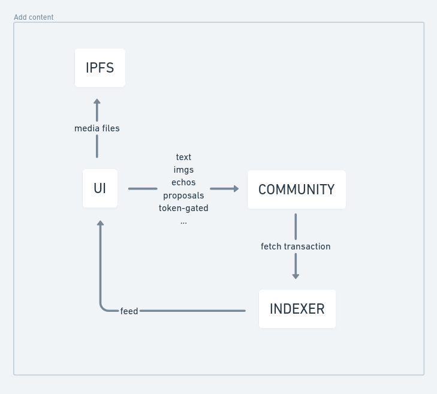

# Content

Contents need a lot of storage space to save. On top of this, in Popula, we also want to use the protocol layer to prove what community participants have done, these lead to greater on-chain storage requirements.

A common way to meet the data requirement is to store all necessary data in transactions on-chain, and the users have to pay storage fees for their data. The advantage of this method is that it is fully decentralized, with all get and set methods in the contract. However, the users have to pay more, and not using the allowance feature in Near Protocol is also a waste.

Here we choose another approach to achieve our goal. The purpose is to prove that someone said something, so we only need to store a hash of the content and make it anti-collision most approximately. This can be represented as:

```
                                  `target_hash = Hash(text + block_number)`
```

The `target_hash` will be the output of this action, so the plain text will be mapped to this `target_hash` in the history block. We can then determine who sent the text and what the `target_hash` is. But how can the contract know who sent the text? We provide:

```
                             `hierarchy_hash = Hash(account_id + target_hash)`
```

And that's the final hash to be stored. If it's a post in a community, others can find it by providing a `target_hash` and `account_id`. For multi-layers of content, it just needs to be stacked to an array to represent these contents. Then, the hashing procedure is as follows:

```
                 `hierarchy_hash = Hash(hash_prefix + account_id + target_hash)`
```

`hash_prefix` is the last layer of `hierarchy_hash`. So why we don't hash it once? Regardless of one-step or two-step hashing, we still need to provide `account_id` of each layer of content to let the contract know who is gaining drips in our protocol layer.

In practice, we choose sha256 as the hashing function, which means the final hash is 32 bytes. We reserve 1 1-byte value to represent other data, and for now it is only used to represent the next layer content count, using 2 bits to represent 0, 1, 2, and other numbers. Finally, we can assume that a single content will likely take 40 bytes.

Depending on that, we can build a tech flow that looks like this:

<figure><figcaption></figcaption></figure>

We can embed anything that can be turned into binary. Just add some fields into the text to represent everything that users need.

But for media files, they need an IPFS service to store them. The URL of these files can be embedded into the text.

Once an `add_content` the transaction is done, the indexer will get this transaction after a few delays (smaller than 3 sec) and push it into the feed. And the poster gets 1 active drip in the community.
